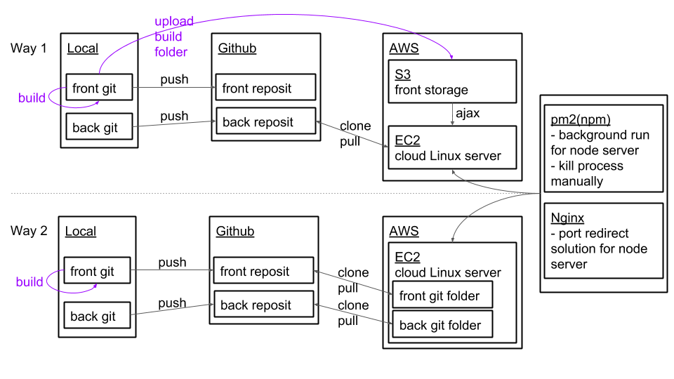
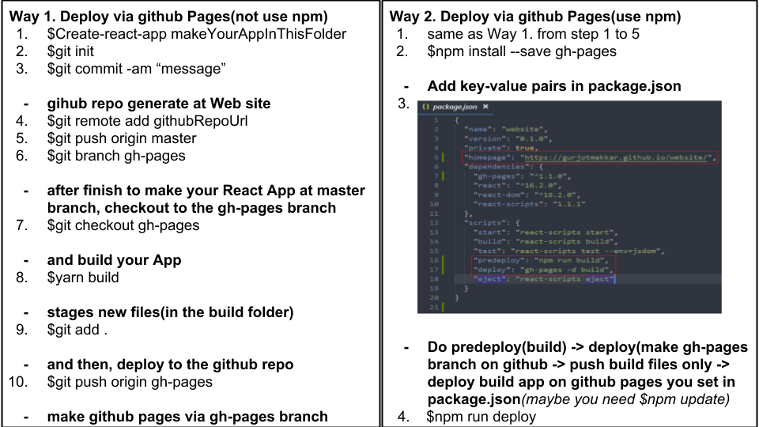

# Deploy

## Deploy using Github and AWS EC2/S3
The basic way to deploy App via Github and AWS

<p align="center">
  
  <br>Deploy using EC2 and S3 of AWS
</p>

### Sequence to build and run React App via AWS EC2 server 
<b>1. Create-react-app</b><br>
React project development<br>

<b>2. Webpack do minimization, make predeploy files at /build folder</b><br>
```
$yarn build
```
<b>3. [AWS EC2 Node web server construct via this way](http://cinema4dr12.tistory.com/741)</b><br>

<b>4. Run with basic server: serve</b><br>
serve? using static server for environment using Node<br>
```
$npm install -g serve
```

Run React App via build folder you build at step 2.
```
$serve -s build
```

Now you connect React App you made by EC2 public ip on Web.

*ref. [Ways of Deployment](https://facebook.github.io/create-react-app/docs/deployment)<br>

## React App Front-end deploy only, via github Pages

<p align="center">
  
  <br>Deploy React App with github pages
</p>

*ref. [Deploy React to GitHub-Pages to create an amazing website!](https://codeburst.io/deploy-react-to-github-pages-to-create-an-amazing-website-42d8b09cd4d)
